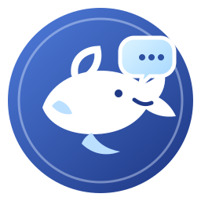
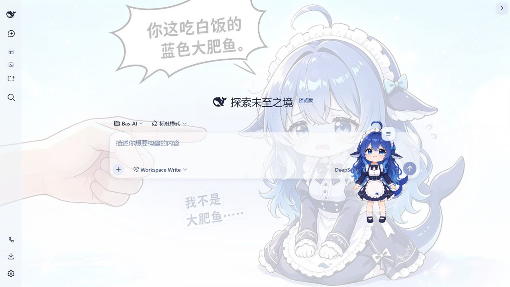
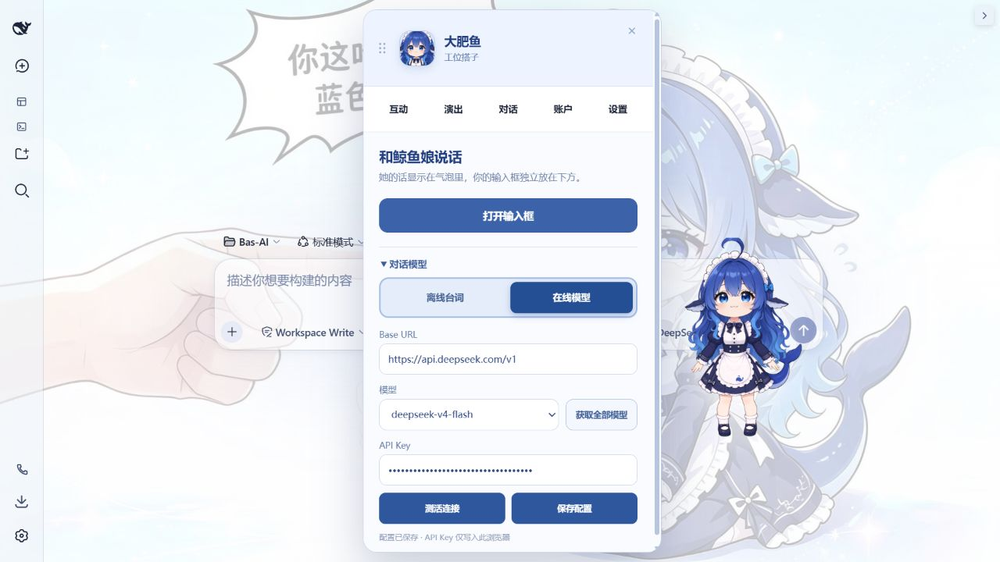
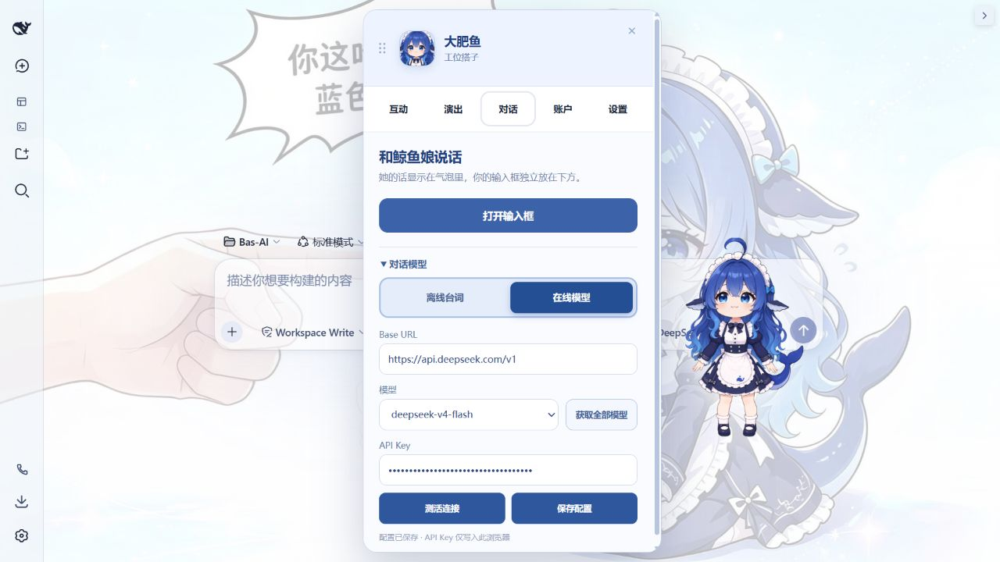
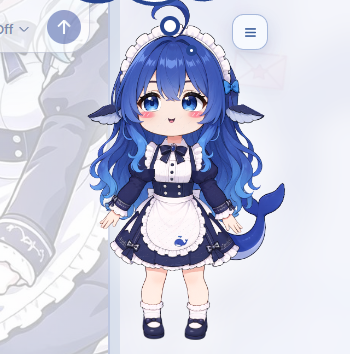
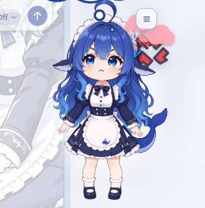

<p align="center">
  
</p>

<h1 align="center">dsh-dfy</h1>

<p align="center"><strong>住进 DeepSeek Harness 工作台的鲸鱼娘桌宠</strong></p>

<p align="center">
  会呼吸、会摇晃、能抓起来玩，也会看懂 DSH 的工作节奏，用表情、道具和对话陪你完成任务。
</p>

<p align="center">
  <a href="./README.en.md">English</a>
  · <a href="#安装">安装</a>
  · <a href="#实机画面">实机画面</a>
  · <a href="#功能">功能</a>
  · <a href="#和-dsh-如何协作">原理</a>
</p>

<p align="center">
  <a href="https://www.npmjs.com/package/dsh-dfy"></a>
  <a href="https://www.npmjs.com/package/dsh-dfy"></a>
  <a href="https://github.com/D70w/dsh-dfy/stargazers"></a>
  
  
  <a href="./LICENSE"></a>
</p>

<p align="center">
  
</p>

---

## 她能做什么

| 像桌宠一样互动 | 有情绪地回应 | 跟随 DSH 工作 | 在 DSH 内对话 |
| --- | --- | --- | --- |
| 点击 Q 弹、抓取摇晃、缩放与位置记忆 | 16 种情绪、独立眼眉嘴变形与语义道具 | 读文件、搜索、命令、写入和任务结果都有反馈 | 离线台词或自定义 OpenAI 兼容模型 |

> 当前稳定互动入口只有：**摸摸她、给她白饭、和她说话、让她表演**。开发中的实验动作不会混入正式功能说明。

## 实机画面

> 以下画面直接截取自最新版 DSH Web Profile 中正在运行的插件，不是测试页或概念图。截图使用空白会话并收起会话与文件侧栏，不包含用户对话历史、工作区文件列表或调试面板。

<p align="center">
  
</p>

<p align="center"><strong>桌宠与 DSH 工作台自然共存</strong> · 不遮挡主要操作区域</p>

<table>
  <tr>
    <td width="50%"></td>
    <td width="50%"></td>
  </tr>
  <tr>
    <td align="center"><strong>互动菜单</strong><br />常用动作与最近互动记录</td>
    <td align="center"><strong>对话设置</strong><br />离线模式与自定义在线模型</td>
  </tr>
</table>

### 情绪瞬间

表情不只是换一句台词：眼睛、眉毛、嘴型、身体姿态和周围特效会一起变化。

<table>
  <tr>
    <td width="50%"></td>
    <td width="50%"></td>
  </tr>
  <tr>
    <td align="center"><strong>喜欢</strong><br />柔和眼神、腮红与爱心信笺</td>
    <td align="center"><strong>生气</strong><br />压眉撇嘴与四瓣怒气符号</td>
  </tr>
</table>

### 跟着 DSH 一起工作

桌宠会读取 DSH 提供的有限工作状态，而不是只在旁边循环待机。读文件、搜索、执行命令、写入，以及任务成功或失败，都有不同的表情、姿态、气泡和道具反馈。

## 功能

### Live2D 风格桌宠

- 透明 Canvas 分层渲染，统一使用 1280×1280 设计坐标系。
- 头发、呆毛、眼睛、眉毛、耳朵、身体、裙子、腿、尾巴和服装附件分别驱动。
- 呼吸、眨眼、视线、身体关节与次级部件持续运动。
- 支持抓取点物理：离抓取点越远，惯性摆动越明显。
- 点击会触发 QQ 弹、局部跟随、随机表情和可持续腮红。
- 桌宠大小、位置、安静模式和减少动态设置保存在当前设备。

### 表情与演出

- 喜欢、害羞、生气、惊讶、难过、开心、困惑、委屈、困倦、得意、期待、坏笑、安心、认真、紧张和馋嘴等情绪。
- 每种情绪使用不同的眼眉嘴变形、身体姿态与粒子效果。
- 爱心、怒气、问号、眼泪、汗滴、`Z` 和白饭均为视觉特效，不是文字占位。
- 可随机播放已校准的一次性演出视频；播放期间与实时桌宠无缝交接。

### 对话与记忆

- 头顶气泡只显示鲸鱼娘说的话，独立输入框位于角色下方并可拖动。
- 支持符合角色设定的离线台词，也可接入 OpenAI 兼容接口。
- 可保存多个模型配置、检测连接并读取模型列表。
- 本地保存有限的对话历史与轻量记忆，在线模型会参考最近上下文。
- 在线调用失败时会清晰回退到离线回应，不会让角色失去反应。

### DSH 工作状态联动

- 识别待机、思考、工具调用、任务成功和任务失败等有限状态。
- 思考会经历等待、分析和整理三个连续阶段，不会长期停在同一个表情。
- 读文件、搜索、命令和写入分别使用文档、放大镜、终端和写入工具等语义道具。
- 成功与失败使用不同的身体姿态、气泡台词与结果道具，避免同质化反馈。
- 只接收状态类别与发生顺序，不读取提示词、工具参数、文件路径或输出正文。

### 余额与本地账单

- Host 端代理 DeepSeek 官方余额接口，浏览器端不会接触 Host 凭据。
- 可设置定时刷新，默认每 10 分钟更新一次官方余额。
- 根据 DSH 提供的输入、缓存命中、缓存写入和输出 Token 统计本地消耗。
- 可按天和按小时查看用量；官方余额与本地估算始终明确区分。

## 安装

### 推荐：安装到 DSH Web Profile

```sh
dsh plugin --profile web add dsh-dfy
```

安装后启动 DSH：

```sh
dsh web --port 3088
```

也可以在普通 npm 项目中安装：

```sh
npm install dsh-dfy
```

> 插件运行依赖由 DSH Web Profile 提供。如果普通 npm 项目自动解析整套 DSH peer 依赖时出现 `ERESOLVE`，可使用 `npm install --legacy-peer-deps dsh-dfy`。

### 本地包验收

```sh
corepack pnpm install
corepack pnpm run build
npm pack
dsh plugin --profile web add ./dsh-dfy-0.1.6.tgz
```

## 和 DSH 如何协作

`dsh-dfy` 以一个 Host/Browser Cordis 插件运行：

- 界面挂载到 `shell.overlay` 与 `settings.section`，不会替换 DSH 主页面。
- Host 端只向浏览器投影有限状态，不传递提示词、工具参数、文件路径或输出正文。
- 角色设置和位置保存在当前设备，不会跨设备同步。
- 正式安装包只分发 `character-packs/default-whale/runtime/production-v1/` 运行资源。

<details>
<summary><strong>开发与验证</strong></summary>

完整检查：

```sh
corepack pnpm install
corepack pnpm run verify
```

`verify` 包含 TypeScript 类型检查、312 个 Vitest 测试、正式构建和 npm 包内容预览。

真实浏览器验收：

```sh
python tests/run_browser_e2e.py --dsh-home <isolated-dsh-home> --port 3088
```

视觉调试面板仅在 URL 带 `?whaleDebug=1` 时启用。

</details>

<details>
<summary><strong>仓库与 npm 包边界</strong></summary>

仓库保留源码、测试、正式运行资源、许可证以及归档开发文档。npm 正式包只包含构建产物、运行资源、README 和许可证，不包含：

- `node_modules/`、构建缓存和测试输出；
- `artifacts/` 中的历史预览、视频分析与验收截图原件；
- PSD、临时抠图源和 E2E 临时 DSH Home；
- `character-packs/default-whale/source/` 下的开发期源素材；
- `docs/archive/` 中的体验、设计和后续规划文档。

</details>

## 已知限制

- 大角度肘部表演、跳跃落地、更丰富的嘴型和更多语义表情仍需要新的局部素材与网格权重。
- 当前白饭互动不会真正扣减库存。
- 八小时长时间运行、低端设备性能测试和完整屏幕阅读器验收仍属于后续发布门槛。
- 当前工作联动基于 DSH 暴露的通用状态类别；更细的工具语义需要 DSH 后续提供更精确且隐私安全的事件。

## 许可证与素材

插件代码采用 [MIT License](./LICENSE)。默认角色是“鲸鱼娘形象”的获批 chibi-maid 衍生资源，角色栅格素材遵循 CC BY-NC-SA 4.0。作者、来源、改动链和再分发说明见 [ASSETS_LICENSE.md](./ASSETS_LICENSE.md) 与 [character-packs/default-whale/SOURCE.md](./character-packs/default-whale/SOURCE.md)。

<p align="center">
  <strong>让工作台里真的住着一位会回应你的鲸鱼娘。</strong>
</p>
